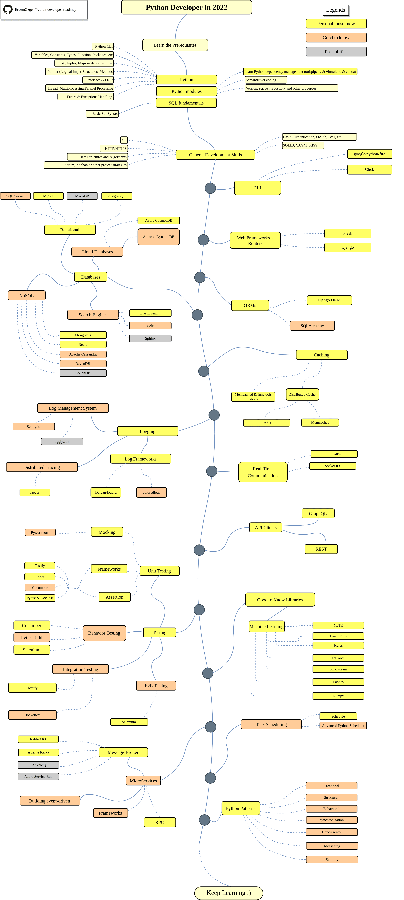

# Python Developer Roadmap

> Roadmap to becoming a [Python](https://www.python.org/) developer in 2021-2022:
Below you can find a chart demonstrating the paths that you can take and the libraries that you would want to learn to become a Python developer. I made this chart as a tip for everyone who asks me, "*What should I learn next as a Python developer?*"

## Disclaimer

> The purpose of this roadmap is to give you an idea about the landscape. The road map will guide you if you are confused about what to learn next, rather than encouraging you to pick what is hype and trendy. You should grow some understanding of why one tool would be better suited for some cases than the other and remember hype and trendy does not always mean best suited for the job.

## Give a Star! :star:

If you like or are using this project to learn or start your solution, please give it a star. Thanks!

## Roadmap

## TODO:
* Add Microservices
* Good to Know Libraries
* Add API Clients
* Add extra subtree for data process and data manipulation 
* Add for ML & DL subtree

## Resources

1. Prerequisites

   - [Python](https://docs.python.org/3/tutorial/index.html)
   - [Python Modules](https://docs.python.org/3/tutorial/modules.html)
   - [SQL](https://www.w3schools.com/sql/default.asp)

2. General Development Skills

   - Learn GIT, create a few repositories on GitHub, share your code with other people
   - Know HTTP(S) protocol, request methods (GET, POST, PUT, PATCH, DELETE, OPTIONS)
   - Don't be afraid of using Google, [Power Searching with Google](http://www.powersearchingwithgoogle.com/)
   - Read a few books about algorithms and data structures
   - Learn about implementation of a basic Authentication
   - Solid principles, architectural & design patterns, ecc
   - Basics of software testing (unit, integration, e2e)

3. CLI Tools
   1. [google/python-fire](https://github.com/google/python-fire)
   2. [click](https://click.palletsprojects.com/en/8.0.x/)

4. Web Frameworks + Routers

   1. [Flask](https://flask.palletsprojects.com/en/2.0.x/)
   2. [Django](https://www.djangoproject.com/)

5. Databases

   1. Relational
      1. [SQL Server](https://www.microsoft.com/en-us/sql-server/sql-server-2017)
      2. [PostgreSQL](https://www.postgresql.org/)
      3. [MariaDB](https://mariadb.org/)
      4. [MySQL](https://www.mysql.com/)
     
   2. Cloud Databases
      - [CosmosDB](https://docs.microsoft.com/en-us/azure/cosmos-db)
      - [DynamoDB](https://aws.amazon.com/dynamodb/)
   3. Search Engines
      - [ElasticSearch](https://www.elastic.co/)
      - [Solr](http://lucene.apache.org/solr/)
      - [Sphinx](http://sphinxsearch.com/)
   4. NoSQL
      - [MongoDB](https://www.mongodb.com/)
      - [Redis](https://redis.io/)
      - [Apache Cassandra](http://cassandra.apache.org/)
      - [RavenDB](https://github.com/ravendb/ravendb)
      - [CouchDB](http://couchdb.apache.org/)

6. ORMs

   1. [Django ORM](https://docs.djangoproject.com/en/3.2/topics/db/queries/)
   2. [SQLAlchemy](https://www.sqlalchemy.org/)
   3. [Extra](https://www.fullstackpython.com/object-relational-mappers-orms.html)
7. Caching

   1. [Memcached](https://pypi.org/project/python-memcached/)
   2. Distributed Cache
      1. [Redis](https://github.com/redis/redis-py)
      2. [Memcached](https://pypi.org/project/python-memcached/)

8. Logging

   1. Log Frameworks
      - [Delgan/loguru](https://github.com/Delgan/loguru)
      - [Coloredlogs](https://github.com/xolox/python-coloredlogs)
      -
   2. Log Management System
      - [Sentry.io](http://sentry.io)
      - [Loggly.com](https://loggly.com)
   3. Distributed Tracing
      - [Jaeger](https://www.jaegertracing.io/)

9. Real-Time Communication
   1. [SignalPy](https://pypi.org/project/SignalPy/)
   2. [Socket.IO](https://python-socketio.readthedocs.io/en/latest/)

10. API Clients

    1. REST

    2. [GraphQL](https://graphql.org/)

11. Good to Know

12. Testing

    1. Unit, Behavior, Integration Testing
       1. [Pytest-mock](https://pypi.org/project/pytest-mock/)
       2. [Testify](https://github.com/stretchr/testify)
       3. [Robot](https://robotframework.org/#/)
       4. [Pytest](https://docs.pytest.org/en/6.2.x/)
       5. [Doctest](https://docs.python.org/3/library/doctest.html)
       6. [Pytest-bdd](https://docs.pytest.org/en/6.2.x/)
       7. [Cucumber](https://cucumber.io/docs/installation/python/)
       8. [Dockertest](https://github.com/ory/dockertest)
    2. E2E Testing
       - [Selenium](https://github.com/tebeka/selenium)
       - [Endly](https://github.com/viant/endly)

13. Task Scheduling

    - [scedule](https://schedule.readthedocs.io/en/stable/)
    - [Advanced Python Scheduler](https://apscheduler.readthedocs.io/en/3.x/)
    
14. MicroServices

    1. Message-Broker
       - [RabbitMQ](https://www.rabbitmq.com/tutorials/tutorial-one-go.html)
       - [Apache Kafka](https://kafka.apache.org/)
       - [ActiveMQ](https://github.com/apache/activemq)
       - [Azure Service Bus](https://docs.microsoft.com/en-us/azure/service-bus-messaging/service-bus-messaging-overview)
    2. Building message-driven
       -
    3. Frameworks

    4. RPC
         
15. [Python-Patterns](https://refactoring.guru/design-patterns)

## Wrap Up

If you think the roadmap can be improved, please do open a PR with any updates and submit any issues. Also, I will continue to improve this, so you might want to star this repository to revisit.

Idea from : [Go developer roadmap](https://github.com/Alikhll/golang-developer-roadmap)

## Contribution

The roadmap is built using [Draw.io](https://www.draw.io/). Project file can be found at `python-developer-roadmap.xml` file. To modify it, open draw.io, click **Open Existing Diagram** and choose `xml` file with project. It will open the roadmap for you. Update it, upload and update the images in readme and create a PR (export as png with 400% zoom and minify that with [Compressor.io](https://compressor.io/compress)).

- Open a pull request with improvements
- Discuss ideas in issues
- Spread the word
